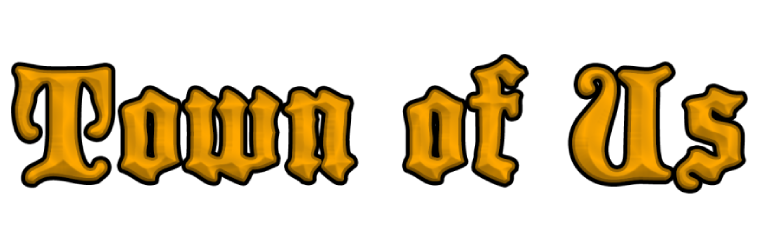
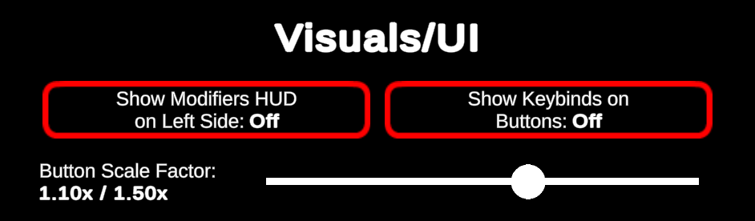
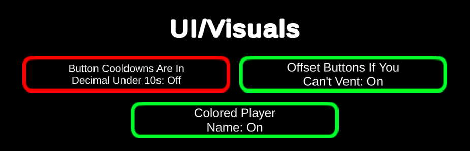

  
  
Town Of Us Mira

  
  

 

An [Among Us](https://store.steampowered.com/app/945360/Among_Us) extension mod for [TOU Mira](https://github.com/AU-Avengers/TOU-Mira) that brings back the old Town of Us and pre-2021 Among Us feeling.

-----------------------

# Visual Changes

- Old button artwork for Vanilla (excluding its non-basic roles, haunt, and wardrobe button)
- Old button artwork for *most* TOU Roles (Excluding a handful of new roles)
- Localized vanilla artwork for Vanilla (soon)

-----------------------

# Recommended TOU Mira & MiraAPI Settings

Use the following settings to get the best experience with this mod, as it will make the game feel more like pre-2021 Among Us.

  
  
Found under the MiraAPI Local Settings

  
  
Found under the TOU Mira Local Settings

-----------------------

# License
This software is distributed under the GNU GPLv3 License. BepInEx is distributed under the LGPL-2.1 License.

# Copyright

This mod is not affiliated with Among Us or Innersloth LLC, and the content contained therein is not endorsed or otherwise sponsored by Innersloth LLC. Portions of the materials contained herein are property of Innersloth LLC.

© Innersloth LLC.

